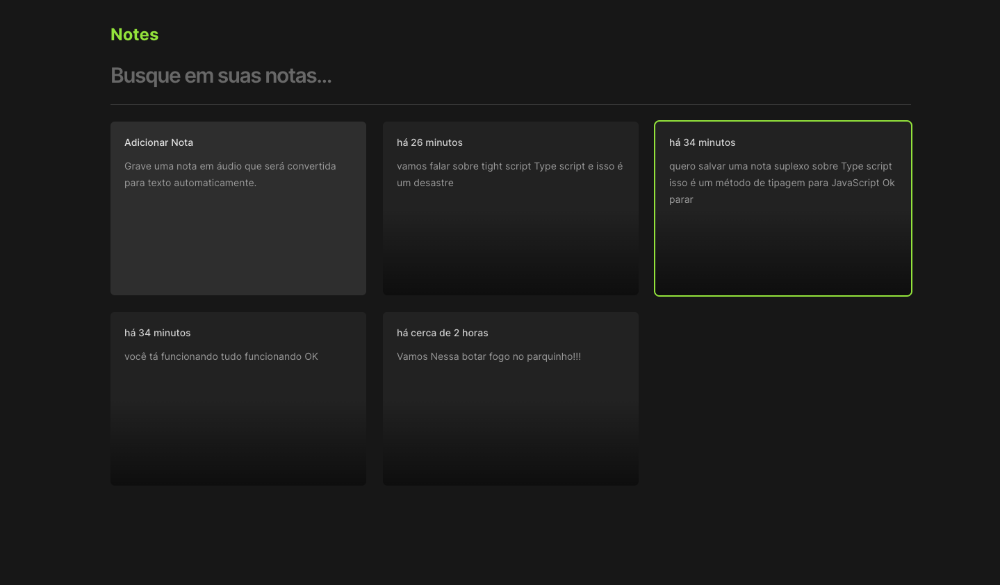

# Notes


<div align="center">
  <a href="https://opensource.org/licenses/MIT"></a>
</div>

<p align="center">
  <a href="#interrobang-what-is-inter">About</a>&nbsp;&nbsp;&nbsp;|&nbsp;&nbsp;&nbsp;
  <a href="#technologies">Technologies used</a>&nbsp;&nbsp;&nbsp;|&nbsp;&nbsp;&nbsp;
  <a href="#construction_worker-how-to-use-developing">How to portfolio</a>&nbsp;&nbsp;&nbsp;|&nbsp;&nbsp;&nbsp;
  <a href="#key-license">License</a>
</p>

<h1 align='center'>
  
</h1>

## PREVIEW
<button style="
    background:#3294F8;
    border:none;
    border-radius: 4px;
    width: 90px;
    height: 30px;
    cursor:pointer;
    ">
  <a style="text-decoration:none;color:white;font-weight:bold;"
    href="https://blogrepository.vercel.app/"
    >Deploy</a>
</button>

## Getting Started BlogRepository

First, run the development server:

```bash
npm run dev
# or
yarn dev
```
## 🚀 Technologies:

This Front-End project was developed using the following technologies:

-   [Typescript][typescript]
-   [ViteJs][vitejs]
-   [Lucide][lucidereact]
-   [Date fns][date-fns]
-   [Sonner][sonner]
-   [Radix-Primitives][radix]
-   [Tailwind Css][tailwindcss]
-   [React Router Dom][react-router-dom]

This project in under MIT license, for more details check in [LICENSE][license]. <br>
Feel free to bring new features or fix problems, it will be a pleasure! 💜


<div align='center'>
  Made with 💚  by <strong>Jefferson Charlles</strong> 🔥
  <a href='https://www.linkedin.com/in/jeffersoncharlles/'>Get in touch!</a>
</div>

[typescript]: https://www.typescriptlang.org/
[nextjs]: https://nextjs.org/
[vitejs]: https://vitejs.dev/
[styled]: https://styled-components.com/
[react-router-dom]: https://reactrouter.com/
[tailwindcss]: https://tailwindcss.com/
[phosphoricons]: https://phosphoricons.com/
[tailwindcss]: https://tailwindcss.com/
[lucidereact]: https://lucide.dev/
[radix]: https://www.radix-ui.com/primitives
[sonner]: https://sonner.emilkowal.ski/
[react-hook-form]: https://react-hook-form.com/
[sass]: https://sass-lang.com/
[axios]: https://axios-http.com/docs/intro
[prismic]: https://prismic.io/
[stripe]: https://stripe.com/br
[react-icons]: https://react-icons.github.io/react-icons/
[rc-slider]: https://slider-react-component.vercel.app/
[date-fns]: https://date-fns.org/
[git]: https://git-scm.com
[fauna]: https://fauna.com/
[yarn]: https://yarnpkg.com/
[license]: ./LICENSE
[linkedin]: https://www.linkedin.com/in/jeffersoncharlles/

## 🔗 Links
[](https://jefferdeveloper.com/)
[](https://www.linkedin.com/jeffersoncharlles)
